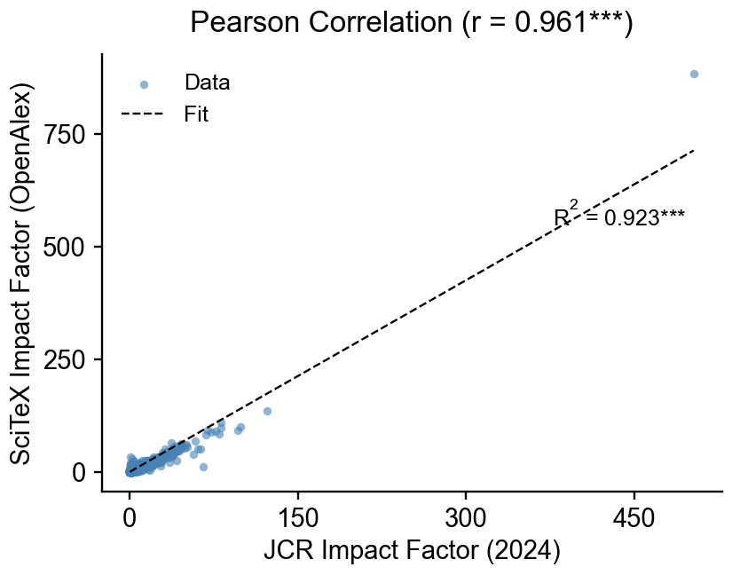

# OpenAlex Local

Local OpenAlex database with 284M+ scholarly works, abstracts, and semantic search.

[](https://badge.fury.io/py/openalex-local)
[](https://openalex-local.readthedocs.io/en/latest/)
[](https://github.com/ywatanabe1989/openalex-local/actions/workflows/test.yml)
[](https://www.python.org/downloads/)
[](LICENSE)

<details>
<summary><strong>Why OpenAlex Local?</strong></summary>

**Built for the LLM era** - features that matter for AI research assistants:

| Feature | Benefit |
|---------|---------|
| **284M Works** | More coverage than CrossRef |
| **Abstracts** | ~45-60% availability for semantic search |
| **Concepts & Topics** | Built-in classification |
| **Author Disambiguation** | Linked to institutions |
| **Open Access Info** | OA status and URLs |

Perfect for: RAG systems, research assistants, literature review automation.

</details>

<details>
<summary><strong>Installation</strong></summary>

```bash
pip install openalex-local
```

From source:
```bash
git clone https://github.com/ywatanabe1989/openalex-local
cd openalex-local && make install
```

Database setup (~300 GB, ~1-2 days to build):
```bash
# Check system status
make status

# 1. Download OpenAlex Works snapshot (~300GB)
make download-screen  # runs in background

# 2. Build SQLite database
make build-db

# 3. Build FTS5 index
make build-fts
```

</details>

<details>
<summary><strong>Python API</strong></summary>

```python
from openalex_local import search, get, count

# Full-text search (title + abstract)
results = search("machine learning neural networks")
for work in results:
    print(f"{work.title} ({work.year})")
    print(f"  Abstract: {work.abstract[:200]}...")
    print(f"  Concepts: {[c['name'] for c in work.concepts]}")

# Get by OpenAlex ID or DOI
work = get("W2741809807")
work = get("10.1038/nature12373")

# Count matches
n = count("CRISPR")
```

</details>

<details>
<summary><strong>CLI</strong></summary>

```bash
openalex-local search "CRISPR genome editing" -n 5
openalex-local search-by-doi W2741809807
openalex-local search-by-doi 10.1038/nature12373
openalex-local status  # Configuration and database stats
```

With abstracts (`-a` flag):
```
$ openalex-local search "neural network" -n 1 -a

Found 1,523,847 matches in 45.2ms

1. Deep learning for neural networks (2015)
   OpenAlex ID: W2741809807
   Abstract: This paper presents a comprehensive overview of deep learning
   techniques for neural network architectures...
```

</details>

<details>
<summary><strong>HTTP API</strong></summary>

Start the FastAPI server:
```bash
openalex-local relay --host 0.0.0.0 --port 31292
```

Endpoints:
```bash
# Search works (FTS5)
curl "http://localhost:31292/works?q=CRISPR&limit=10"

# Get by ID or DOI
curl "http://localhost:31292/works/W2741809807"
curl "http://localhost:31292/works/10.1038/nature12373"

# Batch lookup
curl -X POST "http://localhost:31292/works/batch" \
  -H "Content-Type: application/json" \
  -d '{"ids": ["W2741809807", "10.1038/nature12373"]}'

# Database info
curl "http://localhost:31292/info"
```

HTTP mode (connect to running server):
```bash
# On local machine (if server is remote)
ssh -L 31292:127.0.0.1:31292 your-server

# Python client
from openalex_local import configure_http
configure_http("http://localhost:31292")

# Or via CLI
openalex-local --http search "CRISPR"
```

</details>

<details>
<summary><strong>MCP Server</strong></summary>

Run as MCP (Model Context Protocol) server:
```bash
openalex-local mcp start
```

Local MCP client configuration:
```json
{
  "mcpServers": {
    "openalex-local": {
      "command": "openalex-local",
      "args": ["mcp", "start"],
      "env": {
        "OPENALEX_LOCAL_DB": "/path/to/openalex.db"
      }
    }
  }
}
```

Remote MCP via HTTP:
```bash
# On server: start persistent MCP server
openalex-local mcp start -t http --host 0.0.0.0 --port 8083
```
```json
{
  "mcpServers": {
    "openalex-remote": {
      "url": "http://your-server:8083/mcp"
    }
  }
}
```

Diagnose setup:
```bash
openalex-local mcp doctor        # Check dependencies and database
openalex-local mcp list-tools    # Show available MCP tools
openalex-local mcp installation  # Show client config examples
```

Available tools:
- `search` - Full-text search across 284M+ papers
- `search_by_id` - Get paper by OpenAlex ID or DOI
- `enrich_ids` - Batch lookup with metadata
- `status` - Database statistics

</details>

<details>
<summary><strong>SciTeX Impact Factor (OpenAlex)</strong></summary>

We provide precomputed **SciTeX Impact Factors** calculated from OpenAlex citation data.
These follow the JCR formula but use OpenAlex as the data source.

**Validation against JCR 2024** (17,042 matched journals):

| Metric | Value |
|--------|-------|
| Pearson r | 0.96 |
| Spearman ρ | 0.93 |
| p-value | < 1e-100 |



**Export SciTeX IF:**
```bash
# Export all SciTeX IF values
openalex-local export-if -o scitex_if.csv
openalex-local export-if -o scitex_if.json

# Top 1000
openalex-local export-if -o top1000.csv --limit 1000
```

**Use in search results:**
```bash
openalex-local search "machine learning" --with-if
```

**Formula:**
```
SciTeX IF(Year) = Citations in Year to articles from (Year-1, Year-2)
                  ─────────────────────────────────────────────────────
                  Citable articles published in (Year-1, Year-2)
```

Note: "SciTeX IF" is our calculation using OpenAlex data.
It is not the trademarked "Journal Impact Factor" from Clarivate/JCR.

</details>

<details>
<summary><strong>Related Projects</strong></summary>

**[crossref-local](https://github.com/ywatanabe1989/crossref-local)** - Sister project with CrossRef data:

| Feature | crossref-local | openalex-local |
|---------|----------------|----------------|
| Works | 167M | 284M |
| Abstracts | ~21% | ~45-60% |
| Update frequency | Real-time | Monthly |
| DOI authority | Yes (source) | Uses CrossRef |
| Citations | Raw references | Linked works |
| Concepts/Topics | No | Yes |
| Author IDs | No | Yes |
| Best for | DOI lookup, raw refs | Semantic search |

**When to use CrossRef**: Real-time DOI updates, raw reference parsing, authoritative metadata.
**When to use OpenAlex**: Semantic search, citation analysis, topic discovery.

</details>

<details>
<summary><strong>Documentation</strong></summary>

Full documentation available at [openalex-local.readthedocs.io](https://openalex-local.readthedocs.io/en/latest/)

- [Installation Guide](https://openalex-local.readthedocs.io/en/latest/installation.html)
- [Quickstart](https://openalex-local.readthedocs.io/en/latest/quickstart.html)
- [CLI Reference](https://openalex-local.readthedocs.io/en/latest/cli_reference.html)
- [HTTP API Reference](https://openalex-local.readthedocs.io/en/latest/http_api.html)
- [Python API](https://openalex-local.readthedocs.io/en/latest/api/openalex_local.html)

</details>

<details>
<summary><strong>Data Source</strong></summary>

Data from [OpenAlex](https://openalex.org/), an open catalog of scholarly works.
Updated monthly from their [snapshot](https://docs.openalex.org/download-all-data/openalex-snapshot).

</details>

---

<p align="center">
  <a href="https://scitex.ai"></a>
  <br>
  AGPL-3.0 · ywatanabe@scitex.ai
</p>

<!-- EOF -->
